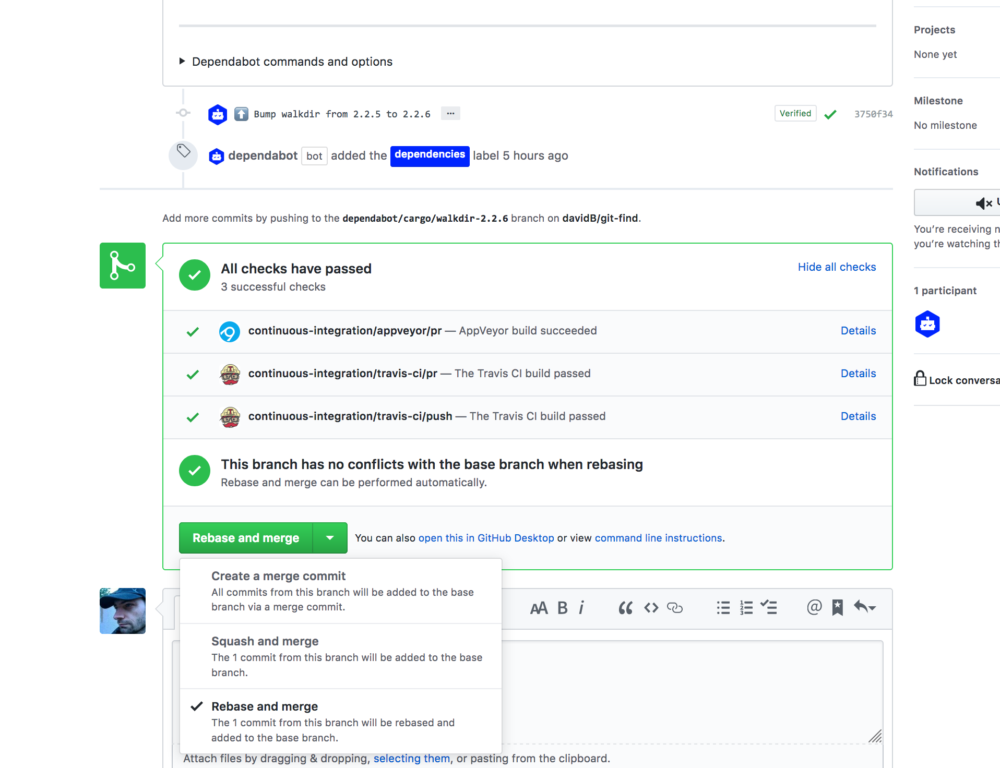
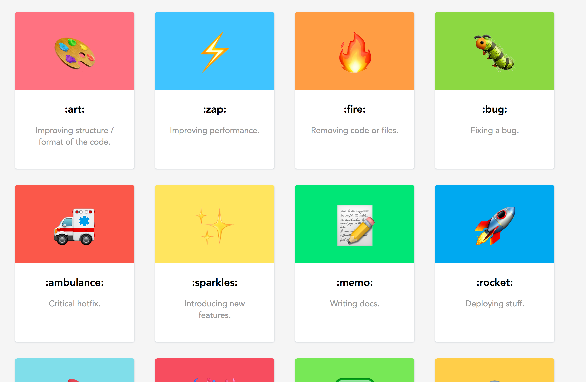
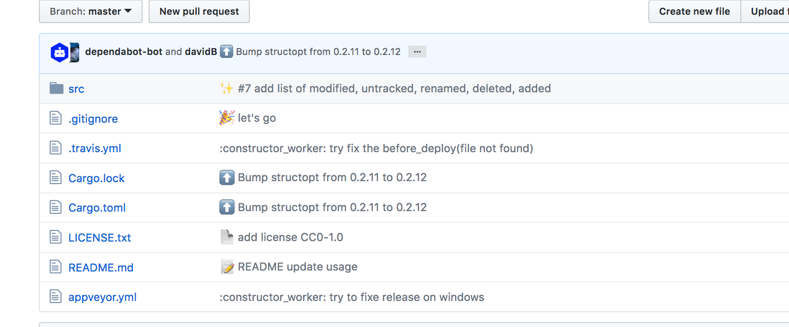
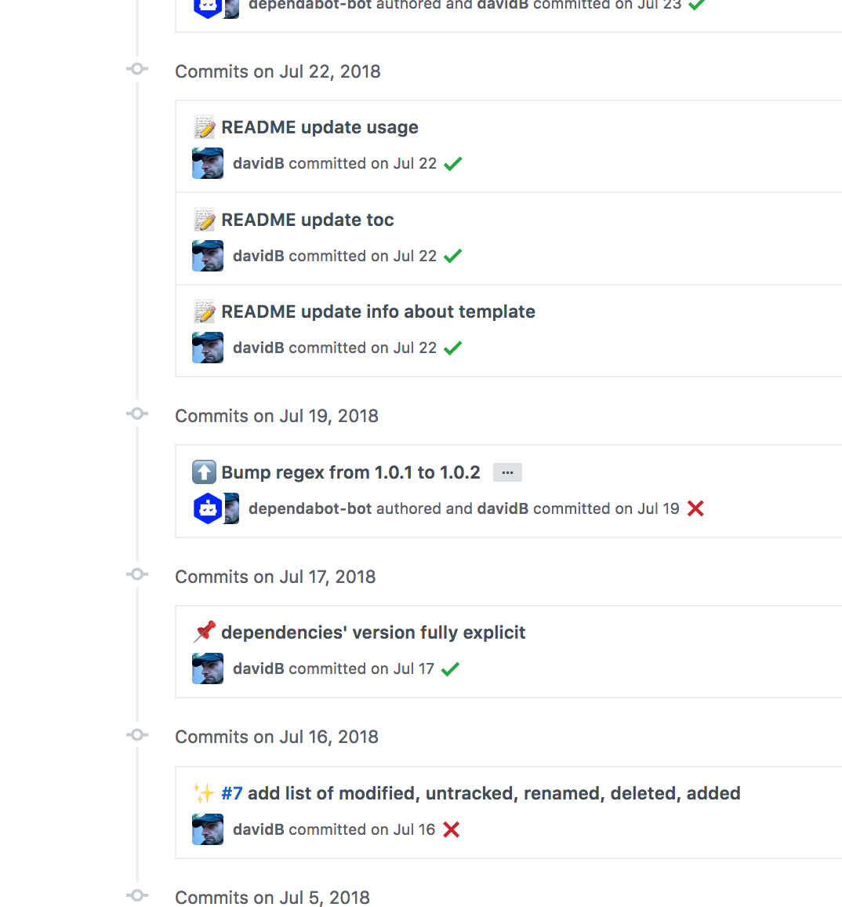
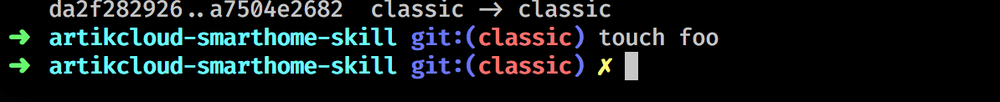

# Les flots gits

## (examples)

note:

- Not a guru
- XP personnal + AKC / SAIL
- goal: overiew & selection
- more questions than responses

---


note:
d scm, local vs central / reference

---

## Branch usages

vvv

### git flow

2010

[A successful Git branching model » nvie.com](https://nvie.com/posts/a-successful-git-branching-model/)

note:

- pas vraiment de branches avant (csv, svn)
- liberation

vvv


note:

- timeline TB vs BT vs RL

vvv


vvv


vvv


vvv

### feature branch only

- simplification
- merge
  - rebase (or not)
  - squash (or not)

vvv

<div class="mermaid">
graph LR
  m1(( )) --> m2(( ))
  m2(( )) --> m3(( ))
  m2(( )) --> d1(( ))
  m3(( )) --> mh(( ))
  d1(( )) --> dh(( ))

classDef dev fill:yellow,stroke:#333
classDef devHead fill:none,stroke:yellow
classDef master fill:aqua,stroke:#333
classDef masterHead fill:none,stroke:aqua
class m1,m2,m3,m4 master;
class d1,d2,d3 dev;
class mh masterHead;
class dh devHead;
</div>
merge
<div class="mermaid">
graph LR
  m1(( )) --> m2(( ))
  m2(( )) --> m3(( ))
  m2(( )) --> d1(( ))
  m3(( )) --> d2(( ))
  d1(( )) -.-> d2(( ))
  d2(( )) --> mh(( ))
classDef dev fill:yellow,stroke:#333
classDef devHead fill:none,stroke:yellow
classDef master fill:aqua,stroke:#333
classDef masterHead fill:none,stroke:aqua
class m1,m2,m3,m4 master;
class d1,d2,d3 dev;
class mh masterHead;
class dh devHead;
</div>
<div class="mermaid">
graph LR
  m1(( )) --> m2(( ))
  m2(( )) --> m3(( ))
  m2(( )) --> d1(( ))
  m3(( )) -.-> d2(( ))
  m3(( )) --> mh(( ))
  d1(( )) --> d2(( ))
  d2(( )) --> dh(( ))
classDef dev fill:yellow,stroke:#333
classDef devHead fill:none,stroke:yellow
classDef master fill:aqua,stroke:#333
classDef masterHead fill:none,stroke:aqua
class m1,m2,m3,m4 master;
class d1,d2,d3 dev;
class mh masterHead;
class dh devHead;
</div>
<div class="mermaid">
graph LR
  m1(( )) --> m2(( ))
  m2(( )) --> m3(( ))
  m2(( )) --> d1(( ))
  m3(( )) -.-> d2(( ))
  m3(( )) --> d3(( ))
  d1(( )) --> d2(( ))
  d2(( )) -.-> d3(( ))
  d3(( )) --> mh(( ))
classDef dev fill:yellow,stroke:#333
classDef devHead fill:none,stroke:yellow
classDef master fill:aqua,stroke:#333
classDef masterHead fill:none,stroke:aqua
class m1,m2,m3,m4 master;
class d1,d2,d3 dev;
class mh masterHead;
class dh devHead;
</div>
squash
<div class="mermaid">
graph LR
  m1(( )) --> m2(( ))
  m2(( )) --> m3(( ))
  m2(( )) --> d1(( ))
  m3(( )) -.-> d2(( ))
  m3(( )) --> d3(( ))
  d1(( )) --> d2(( ))
  d3(( )) --> mh(( ))
classDef dev fill:yellow,stroke:#333
classDef devHead fill:none,stroke:yellow
classDef master fill:aqua,stroke:#333
classDef masterHead fill:none,stroke:aqua
class m1,m2,m3,m4 master;
class d1,d2,d3 dev;
class mh masterHead;
class dh devHead;
</div>

vvv

### fork + PR/MR

- open source
- gerrit

note:

- Gatekeeper human & automatique
- without ticket
- discussion
- proposal without ticket
- utilisation meme apres avoir le pouvoir

vvv



vvv

### master + rebase

- one branche
- Feature Flags
- hotfix branch (exception)
- no issue about branch history (rebase, merge master)

note:

- FF necessite une prez ;-)
- dead code
- ownership & responsability (not for everyone / oss)

vvv

t0 origin
<div class="mermaid">
graph LR
  m1(( )) --> m2(( ))
  m2(( )) --> mh(( ))

classDef dev fill:yellow,stroke:#333
classDef devHead fill:none,stroke:yellow
classDef master fill:aqua,stroke:#333
classDef masterHead fill:none,stroke:aqua
class m1,m2,m3,m4 master;
class d1,d2,d3 dev;
class mh masterHead;
class dh devHead;
</div>
t1 local
<div class="mermaid">
graph LR
  m1(( )) --> m2(( ))
  m2(( )) --> d1(( ))
  d1(( )) --> mh(( ))

classDef dev fill:yellow,stroke:#333
classDef devHead fill:none,stroke:yellow
classDef master fill:aqua,stroke:#333
classDef masterHead fill:none,stroke:aqua
class m1,m2,m3,m4 master;
class d1,d2,d3 dev;
class mh masterHead;
class dh devHead;
</div>

t2 origin
<div class="mermaid">
graph LR
  m1(( )) --> m2(( ))
  m2(( )) --> m3(( ))
  m3(( )) --> mh(( ))

classDef dev fill:yellow,stroke:#333
classDef devHead fill:none,stroke:yellow
classDef master fill:aqua,stroke:#333
classDef masterHead fill:none,stroke:aqua
class m1,m2,m3,m4 master;
class d1,d2,d3 dev;
class mh masterHead;
class dh devHead;
</div>

vvv

t3 local
<div class="mermaid">
graph LR
  m1(( )) --> m2(( ))
  m2(( )) --> m3(( ))
  m3(( )) --> d1(( ))
  d1(( )) --> mh(( ))

classDef dev fill:yellow,stroke:#333
classDef devHead fill:none,stroke:yellow
classDef master fill:aqua,stroke:#333
classDef masterHead fill:none,stroke:aqua
class m1,m2,m3,m4 master;
class d1,d2,d3 dev;
class mh masterHead;
class dh devHead;
</div>

t4 local + origin
<div class="mermaid">
graph LR
  m1(( )) --> m2(( ))
  m2(( )) --> m3(( ))
  m3(( )) --> d1(( ))
  d1(( )) --> mh(( ))

classDef dev fill:yellow,stroke:#333
classDef devHead fill:none,stroke:yellow
classDef master fill:aqua,stroke:#333
classDef masterHead fill:none,stroke:aqua
class m1,m2,m3,m4 master;
class d1,d2,d3 dev;
class mh masterHead;
class dh devHead;
</div>

vvv

### local flow

```sh
git config --global user.name "John Doe"
git config --global user.email j.doe@samsung.com
# rebase by default on git pull
git config --global --bool pull.rebase true

git clone ...

git pull
# work
git add / rm ...
git commit ...
git pull
git push
```

---

## Repo vs project

- mono-repo
- 1 repo - 1 project
- 1 repo - 1 module
- 1 release -> 1 repo

note:

- build/release pipeline integration
- tags, version, branch
- what is a release (main, test u, check, test fonctionnel, pipeline...)

---

## Commit

- message
- size
- scope
- history / changelog

vvv

### Message format

- first
  - [gitmoji | An emoji guide for your commit messages](https://gitmoji.carloscuesta.me/)
  - ticket number (link with issue tracker)
  - scope
  - summary
- description
  - optionnal ?
  - verbose ?
- [git hook](https://githooks.com/)

note:

- no action about ticket (`fix #...`)
- help to scope
- case of merge, squash

vvv



vvv



vvv



### Example

```txt
:wrench: PK-33 (module) tweek configuration
```

```txt
🔧 PK-33 (module) tweek configuration
```

note:

- do note use utf-8 char
- TODO: screenshot of repo's history with this syntax

vvv

### Alternatives 1

[Semantic Commit Messages](https://seesparkbox.com/foundry/semantic_commit_messages)

```txt
chore: add Oyster build script
docs: explain hat wobble
feat: add beta sequence
fix: remove broken confirmation message
refactor: share logic between 4d3d3d3 and flarhgunnstow
style: convert tabs to spaces
test: ensure Tayne retains clothing
```

vvv

### Alternatives 2

[conventional-changelog/angular](https://github.com/conventional-changelog/conventional-changelog/blob/a5505865ff3dd710cf757f50530e73ef0ca641da/conventions/angular.md)

```txt
<type>(<scope>): <subject>
<BLANK LINE>
<body>
<BLANK LINE>
<footer>
```

note:

- more rules (verbs, breaking change , ticket, value)

vvv

### Alternatives 3

[conventional-changelog/jquery](https://github.com/conventional-changelog/conventional-changelog/blob/a5505865ff3dd710cf757f50530e73ef0ca641da/conventions/jquery.md)

```txt
Component: Short Description

Optional Long Description

Fixes #xxx
Closes gh-yyy
Ref #zzz
```

vvv

### Alternatives 4

[tbaggery - A Note About Git Commit Messages](https://tbaggery.com/2008/04/19/a-note-about-git-commit-messages.html)

```txt
Capitalized, short (50 chars or less) summary

More detailed explanatory text, if necessary.  Wrap it to about 72
characters or so.  In some contexts, the first line is treated as the
subject of an email and the rest of the text as the body.  The blank
line separating the summary from the body is critical (unless you omit
the body entirely); tools like rebase can get confused if you run the
two together.

Write your commit message in the imperative: "Fix bug" and not "Fixed bug"
or "Fixes bug."  This convention matches up with commit messages generated
by commands like git merge and git revert.

Further paragraphs come after blank lines.

- Bullet points are okay, too

- Typically a hyphen or asterisk is used for the bullet, followed by a
  single space, with blank lines in between, but conventions vary here

- Use a hanging indent
```

---

## Tags

vvv

### Tags version

- format `major.minor.patch`
- annoted
- trigger release pipeline

```groovy
version = "git describe --always --dirty".execute().text.trim()
```

```txt
434eae7
0.9.2
0.9.2-dirty
0.9.2-1-gac5cb06
```

note:

- why annoted
- why no prefix 'v'
- maybe to use vs sha-1
  - for tags of images (docker,...)
  - for about, healthcheck

---

## Review & CI

- integration with flow
- automatic review (gatekeeper)
- manual review (non-gatekeeper)
- release version (non CD)

---

## More links

- [Git - Contributing to a Project](https://git-scm.com/book/en/v2/Distributed-Git-Contributing-to-a-Project)

---

## Suggestions

vvv

shell prompt with git info



vvv

folder layout as go workspace

```txt
$HOME/src
├── _local
│   ├── micro-reverse-proxy
│   └── prez_workflow_git
├── bitbucket.org
│   ├── c.bras
│   │   └── xt-skills
│   ├── davidB31
│   │   ├── micro-reverse-proxy
│   │   └── xt-gactions
│   ├── francoismonniot
│   │   └── dev
│   ├── samihub
│   │   ├── celerity
│   │   ├── cloud_connector_challenge
│   │   ├── machine-learning
│   │   ├── marathon-jobs-local
│   │   ├── marathon-jobs-omg
│   │   ├── rogerce
│   │   ├── rogerv2
│   │   ├── sami
│   │   ├── sami-akcc
│   │   ├── sami-cloudconnector-samples.dev
│   │   ├── sami-cloudconnector-sdk.dev
│   │   ├── sami-config
│   │   ├── stce-config
│   │   ├── stce-config-prod
│   │   ├── xt-cloudconnector-samples.dev
│   │   └── xt-google-action
│   └── ssic_sail
│       ├── myskinid
│       └── viv-wizard
├── git.vandevlab.com
│   └── ...
├── github.com
│   ├── 99XProblems
│   │   └── 99-Scala-Problems
...
```

---

## Discussion, Q & A

- one-size fit-all ?
- experimentation & collaboration ?
- evolution ?
- git log to generate changelog ?
- fs layout (multi-module, multi tech)
- git workflow guide

note:

- case commit of experiment to able to track it but should not be part of the release (mlflow,...)
  - project for experiment and project for release ?
  - using branch for experiment ?
  - multi-tech == language/ecosystem, framework (main, test fonctionnal,...),
  - commit for test/debug on deployed code
